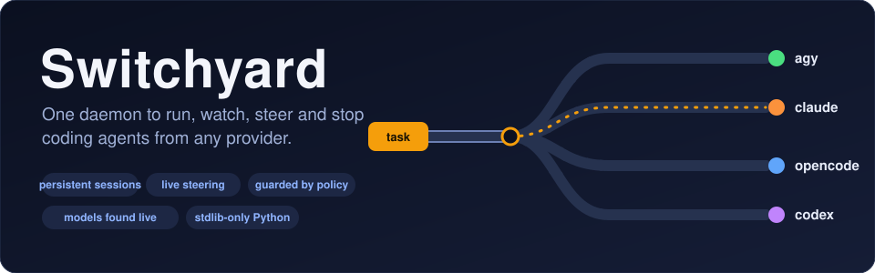
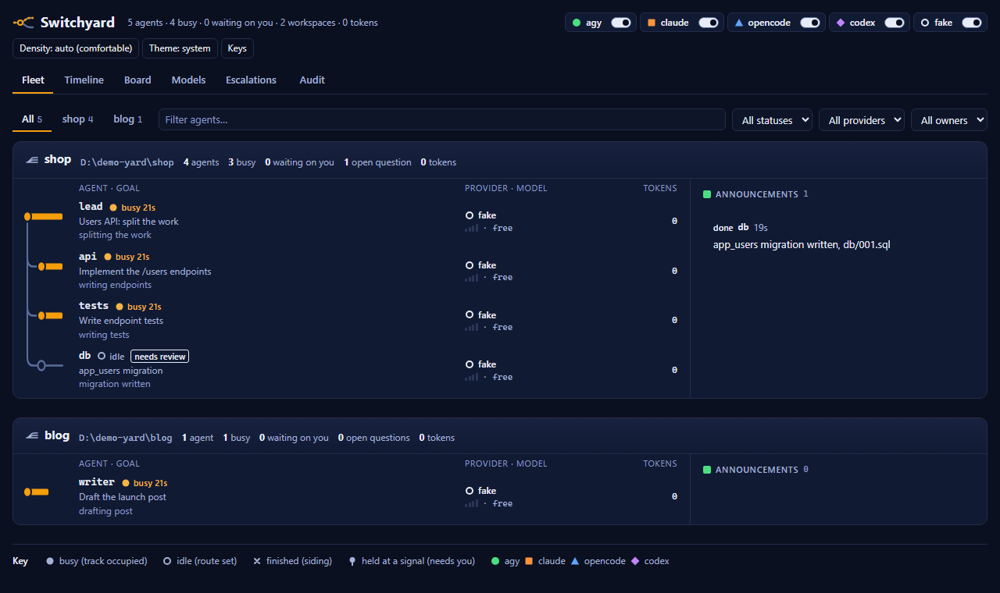
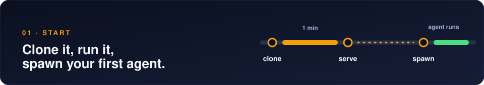
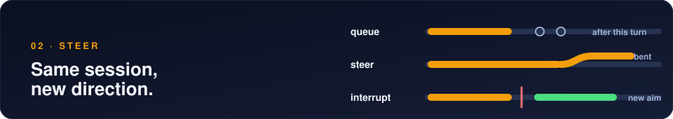
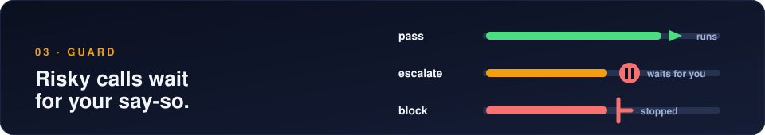
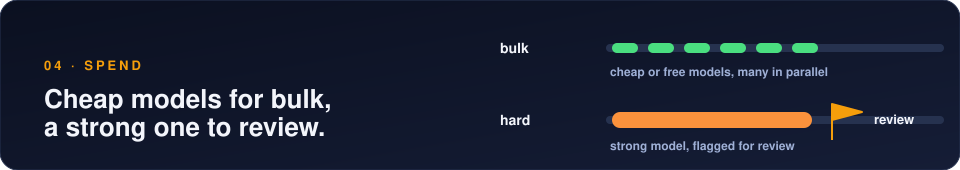
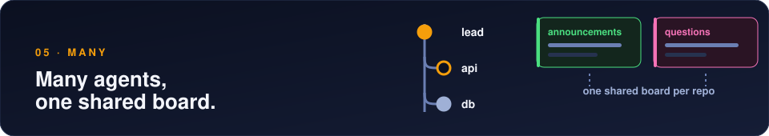
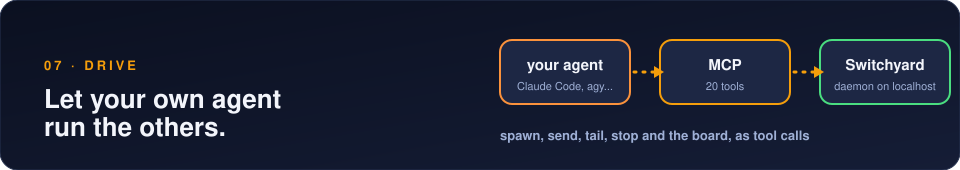
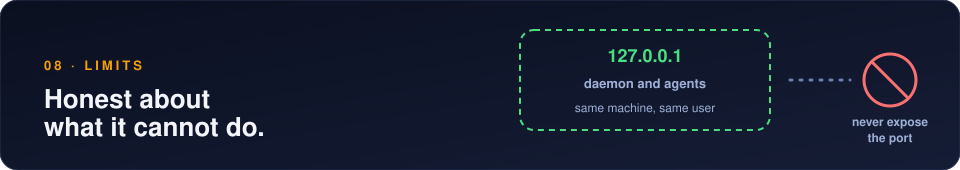

<p align="center"></p>

Coding-agent CLIs are all scriptable, but each one is scriptable in its own way, and the obvious pattern, run it
headless and kill-and-resume to change course, throws away the command that was running and re-pays for the context.

**Switchyard is a small local daemon that keeps one live session per agent, whatever the provider, and gives you one
way to spawn, watch, steer and stop all of them.** Run bulk work on cheap or free agents, keep a strong one for review,
see everything in a dashboard, and let a policy interrupt or stop risky tool calls.

```console
$ python agentctl.py route "rotate the production auth token"      # real output, copied from a run
{ "provider": "claude", "model": "opus", "tier": "hard",
  "reasons": ["sensitive keyword -> hard tier", "tier hard -> claude:opus"], "review": true }

$ python agentctl.py spawn "add retry logic to client.py and run its tests" --cwd ./api
$ python agentctl.py list                       # every agent, its status, tokens used
$ python agentctl.py tail <id>                  # what is it doing right now?
$ python agentctl.py send <id> "also cover the timeout case" --mode interrupt   # new direction, same session
$ python agentctl.py stop <id> --reason "wrong environment"
```

<p align="center"></p>
<p align="center"><sub>Scripted demo agents, so no model was called. Four agents in the <code>shop</code> yard, one in <code>blog</code>.</sub></p>

<p align="center"><b>
<a href="#start-in-4-commands">Start</a> ·
<a href="#steer-without-restarting">Steer</a> ·
<a href="#let-risky-commands-wait-for-you">Guard</a> ·
<a href="#spend-less-on-bulk-work">Spend</a> ·
<a href="#run-many-agents-in-one-repo">Many agents</a> ·
<a href="#pick-your-providers">Providers</a> ·
<a href="#drive-it-from-your-agent">MCP</a> ·
<a href="#know-the-limits">Limits</a>
</b></p>

## Start in 4 commands
<p align="center"></p>

**You need Python 3.10+ and one logged-in provider CLI.** Per-OS steps: [docs/install.md](docs/install.md).

```bash
git clone https://github.com/vassu-v/agent-supervisor-multiprovider_mcp switchyard && cd switchyard
python agentctl.py serve        # leave running
python agentctl.py dashboard    # opens the dashboard in your browser
python agentctl.py spawn "write primes.py, run it, reply with the output" --cwd ../switchyard-demo --provider auto
```

> `python agentctl.py providers` shows what is ready, off, not installed or needs a login.

```console
$ python agentctl.py spawn "write primes.py" --cwd ../switchyard-demo --wait     # blocks, then prints the agent's reply
started a1 on agy:gemini-3.8-flash-high (tier standard) in ../switchyard-demo
...
```

> **What Switchyard writes into your project.** If the working directory has no `AGENTS.md`, it creates one: a shared notes file that every agent reads and appends to. An existing `AGENTS.md` is never replaced. Agents add notes under `## Agent notes`, and nothing is deleted. Logs live in `logs/` inside the Switchyard folder, not in your project.
> Add `--json` to any command for the full machine-readable output.

**Next →** [change course while an agent works](#steer-without-restarting)

## Steer without restarting
<p align="center"></p>

**Pick a mode per message. The session and its context survive.**

| You want | Command |
|---|---|
| Add work after this turn | `send <id> "..."` |
| Adjust mid-turn | `send <id> "..." --mode steer` |
| Change direction now | `send <id> "..." --mode interrupt` |
| Cancel, send nothing | `interrupt <id>` |

**Wait for an agent, or hook it.** Scripts and other agents do not have to poll.

| You want | Command |
|---|---|
| Block until the agent is idle, then print its reply | `wait <id>` (exit code 0 ok, 1 failed, 2 timeout) |
| Spawn and block in one step | `spawn "..." --wait` |
| Run a command when an agent finishes | `hook <id> --on done --run "python notify.py"` |
| See or remove hooks | `hooks` · `unhook <hook-id>` |

> Hooks run without a shell, once by default (add `--repeat`), and only you can set them, not agents. The command gets `SWITCHYARD_AGENT`, `SWITCHYARD_STATUS`, `SWITCHYARD_EVENT` and `SWITCHYARD_RESULT` in its environment. A daemon restart clears them.

**Next →** [risky commands](#let-risky-commands-wait-for-you) · per-provider detail: [docs/providers.md](docs/providers.md)

## Let risky commands wait for you
<p align="center"></p>

**Every tool call is checked against [`orch/policy.json`](orch/policy.json). Edits apply with no restart.**

| Verdict | Examples | Effect |
|---|---|---|
| ✅ pass | reads, tests, local git | none |
| ⏸ escalate | `git push`, `.env`, external POST | agent pauses, you allow or deny, stops after 10 min |
| ⛔ block | `format`, `rm -rf /`, `shutdown` | agent stops at once |

**Next →** [cheap agents](#spend-less-on-bulk-work) · patterns and timeouts: [docs/policy.md](docs/policy.md)

## Spend less on bulk work
<p align="center"></p>

**`provider: auto` picks a provider and model from a tier. Hard-tier results are flagged for review.**

```json
"bulk": { "candidates": ["agy:*flash*medium", "opencode:opencode/*free*", "claude:haiku"] },
"hard": { "candidates": ["claude:opus", "claude:sonnet", "agy:*pro*high", "codex:*"], "review": true }
```

> Words like *auth*, *secret* and *production* bump a task to `hard`. Preview with `agentctl.py route "<task>"`.
> Want a specific model and thinking level? Say so: `--provider claude --model opus --effort high`. It is never rerouted.

**Next →** [many agents in one repo](#run-many-agents-in-one-repo)

## Run many agents in one repo
<p align="center"></p>

**Each agent has its own identity, a place in a tree, and a shared board.**

| Piece | What you get |
|---|---|
| 🌿 Workspace, agent tree | One git root, children under parents |
| 🟢 Green lane | Announcements: started, done, blocked |
| 🩷 Pink lane | Open questions any agent can answer |
| 📋 Briefing | Peers and goals, advisory only |

```console
$ agentctl.py announce "api client done, tests pass" --kind done
$ agentctl.py ask "which port does the mock server use?"
$ agentctl.py list --tree
```

**Next →** [providers](#pick-your-providers) · three-agent example: [docs/collaboration.md](docs/collaboration.md)

## Pick your providers
<p align="center"></p>

**Switch off any provider you lack. Model lists come live from each CLI.**

```bash
python agentctl.py providers disable codex
```

**Next →** [drive it from your agent](#drive-it-from-your-agent) · config and capabilities: [docs/providers.md](docs/providers.md)

## Drive it from your agent
<p align="center"></p>

**Register the MCP server. The daemon must be running.**

```bash
claude mcp add switchyard -- python /path/to/switchyard/orch/mcp_bridge.py
```

> Copy [`skills/switchyard-use`](skills/switchyard-use/SKILL.md) and [`skills/switchyard-setup`](skills/switchyard-setup/SKILL.md) into your agent's skills folder.

**Next →** [limits](#know-the-limits) · every tool: [docs/mcp.md](docs/mcp.md)

## Know the limits
<p align="center"></p>

**Read this before you trust it with anything you cannot lose.**

| Limit | What to do |
|---|---|
| The guard reacts after a tool call starts and cannot undo it | Use a container or VM for real isolation |
| The daemon binds to `127.0.0.1`; agents run with full permissions and can read the admin token | Never expose the port |
| Closing the `serve` terminal ends every agent (they die with the daemon) | Run it in a terminal you keep open |
| Every provider adds its own base context (system prompt, tool definitions) to each turn, and Switchyard adds about 1,700 characters of rules on top. Small tasks can still use tens of thousands of tokens, mostly the provider's own | Judge cost from your provider's usage, not task size |
| Cheaper models make more mistakes | Verify their output |
| Tested on Windows 11 only; Codex never ran against a real Codex | Treat Linux, macOS and Codex as unverified |

**Next →** [the docs](#read-more) · tokens and scopes: [docs/security.md](docs/security.md)

<details>
<summary>Coming next (not built yet)</summary>

- Advisory file claims with expiring leases
- Edit history per agent, with diffs
- Notes in SQLite, rendered to `AGENTS.md`
- Hook enforcement and opt-in worktrees
</details>

## Read more

| | |
|---|---|
| **Setup** | [install](docs/install.md) · [providers](docs/providers.md) · [policy](docs/policy.md) · [security](docs/security.md) |
| **Use** | [mcp](docs/mcp.md) · [collaboration](docs/collaboration.md) · [AGENTS.md](AGENTS.md) · [skills](skills/README.md) |
| **Design** | [PLAN](docs/PLAN.md) · [ROADMAP](docs/ROADMAP.md) |
