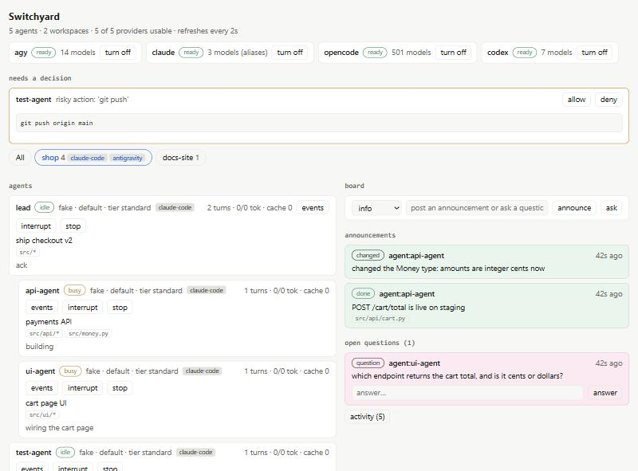

<p align="center"></p>

Coding-agent CLIs are all scriptable, but each one is scriptable in its own way, and the obvious pattern, run it
headless and kill-and-resume to change course, throws away the command that was running and re-pays for the context.

**Switchyard is a small local daemon that keeps one live session per agent, whatever the provider, and gives you one
way to spawn, watch, steer and stop all of them.** Run bulk work on cheap or free agents, keep a strong one for review,
see everything in a dashboard, and let a policy interrupt or stop risky tool calls.

```console
$ python agentctl.py route "rotate the production auth token"      # real output, copied from a run
{ "provider": "claude", "model": "opus", "tier": "hard",
  "reasons": ["sensitive keyword -> hard tier", "tier hard -> claude:opus"], "review": true }

$ python agentctl.py spawn "add retry logic to client.py and run its tests" --cwd ./api
$ python agentctl.py list                       # every agent, its status, tokens used
$ python agentctl.py tail <id>                  # what is it doing right now?
$ python agentctl.py send <id> "also cover the timeout case" --mode interrupt   # new direction, same session
$ python agentctl.py stop <id> --reason "wrong environment"
```

<p align="center"></p>
<p align="center"><sub>Scripted demo agents, so no model was called. Two clients are attached to the <code>shop</code> workspace.</sub></p>

## Start in 4 commands
You need Python 3.10+ and one logged-in provider CLI. Per-OS steps: [docs/install.md](docs/install.md).

```bash
git clone https://github.com/vassu-v/agent-supervisor-multiprovider_mcp switchyard && cd switchyard
python agentctl.py serve        # leave running; dashboard at http://127.0.0.1:8765
python agentctl.py providers    # ready / off / not installed / needs login
python agentctl.py spawn "write primes.py, run it, reply with the output" --cwd ./demo --provider auto
```

Next: [change course while an agent works](#steer-without-restarting).

## Steer without restarting
Pick a mode per message. The session and its context survive.

| You want | Command |
|---|---|
| Add work after this turn | `send <id> "..."` |
| Adjust mid-turn | `send <id> "..." --mode steer` |
| Change direction now | `send <id> "..." --mode interrupt` |
| Cancel, send nothing | `interrupt <id>` |

Next: [risky commands](#let-risky-commands-wait-for-you). Per-provider detail: [docs/providers.md](docs/providers.md).

## Let risky commands wait for you
Every tool call is checked against [`orch/policy.json`](orch/policy.json). Edits apply with no restart.

| Verdict | Examples | Effect |
|---|---|---|
| pass | reads, tests, local git | none |
| escalate | `git push`, `.env`, external POST | agent pauses; stops after 10 min |
| block | `format`, `rm -rf /`, `shutdown` | agent stops at once |

Next: [cheap agents](#spend-less-on-bulk-work). Patterns and timeouts: [docs/policy.md](docs/policy.md).

## Spend less on bulk work
`provider: auto` picks a provider and model from a tier. Hard-tier results are flagged for review.

```json
"bulk": { "candidates": ["agy:*flash*medium", "opencode:opencode/*free*", "claude:haiku"] },
"hard": { "candidates": ["claude:opus", "claude:sonnet", "agy:*pro*high", "codex:*"], "review": true }
```

Words like *auth*, *secret* and *production* bump a task to `hard`. Preview with `agentctl.py route "<task>"`.

Next: [many agents in one repo](#run-many-agents-in-one-repo).

## Run many agents in one repo
Each agent has its own identity, a place in a tree, and a shared board.

| Piece | What you get |
|---|---|
| Workspace, agent tree | One git root, children under parents |
| Green lane | Announcements: started, done, blocked |
| Pink lane | Open questions any agent can answer |
| Briefing | Peers and goals, advisory only |

```console
$ agentctl.py announce "api client done, tests pass" --kind done
$ agentctl.py ask "which port does the mock server use?"
$ agentctl.py list --tree
```

Next: [providers](#pick-your-providers). Three-agent example: [docs/collaboration.md](docs/collaboration.md).

## Pick your providers
Switch off any provider you lack. Model lists come live from each CLI.

```bash
python agentctl.py providers disable codex
```

Next: [drive it from your agent](#drive-it-from-your-agent). Config and capabilities: [docs/providers.md](docs/providers.md).

## Drive it from your agent
Register the MCP server. The daemon must be running.

```bash
claude mcp add switchyard -- python /path/to/switchyard/orch/mcp_bridge.py
```

Copy [`skills/switchyard-use`](skills/switchyard-use/SKILL.md) and [`skills/switchyard-setup`](skills/switchyard-setup/SKILL.md) into your agent's skills folder.

Next: [limits](#know-the-limits). Every tool: [docs/mcp.md](docs/mcp.md).

## Know the limits
- The guard reacts after a tool call starts. It cannot undo. Use a container or VM for isolation.
- The daemon binds to `127.0.0.1`. Agents run with full permissions and can read the admin token. Never expose the port.
- Cheaper models make more mistakes. Verify their output.
- Tested on Windows 11 only. Codex never ran against a real Codex.

Next: [the docs](#read-more). Tokens and scopes: [docs/security.md](docs/security.md).

<details>
<summary>Coming next (not built yet)</summary>

- Advisory file claims with expiring leases
- Edit history per agent, with diffs
- Notes in SQLite, rendered to `AGENTS.md`
- Hook enforcement and opt-in worktrees
</details>

## Read more
Setup: [install](docs/install.md) · [providers](docs/providers.md) · [policy](docs/policy.md) · [security](docs/security.md)
Use: [mcp](docs/mcp.md) · [collaboration](docs/collaboration.md) · [AGENTS.md](AGENTS.md) · [skills](skills/README.md)
Design: [PLAN](docs/PLAN.md) · [ROADMAP](docs/ROADMAP.md)
